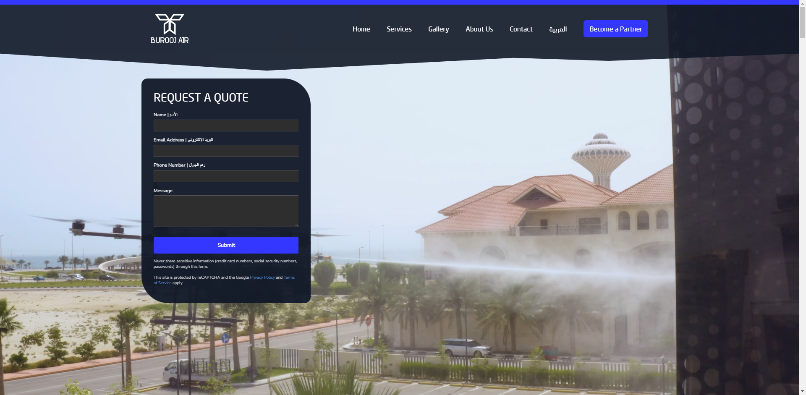

# Burooj Drones

Burooj Air is a drone company based in Saudi Arabia, specializing in industrial and commercial drone solutions. This repository contains the code for our official website, built with Nuxt.js.



## Features

-   Responsive Design
-   Multilingual Support (English and Arabic)
-   Interactive Charts
-   Image Gallery

## Build Setup

```bash
# install dependencies
$ npm install

# serve with hot reload at localhost:3000
$ npm run dev

# build for production and launch server
$ npm run build
$ npm run start

# generate static project
$ npm run generate
```

## Usage Guide

Clone the repository.
Install dependencies using npm install.
Start the development server using npm run dev.
Visit <http://localhost:3000> to view the site.

## Contributing

We welcome contributions! Please see our CONTRIBUTING.md for guidelines on how to contribute to this project.

## License

This project is a commercial website, and its source code is not free for use. It can be used for inspiration only. Unauthorized use, reproduction, distribution, or modification of this code is strictly prohibited. For more details, see the [LICENSE.md](LICENSE.md) file.
